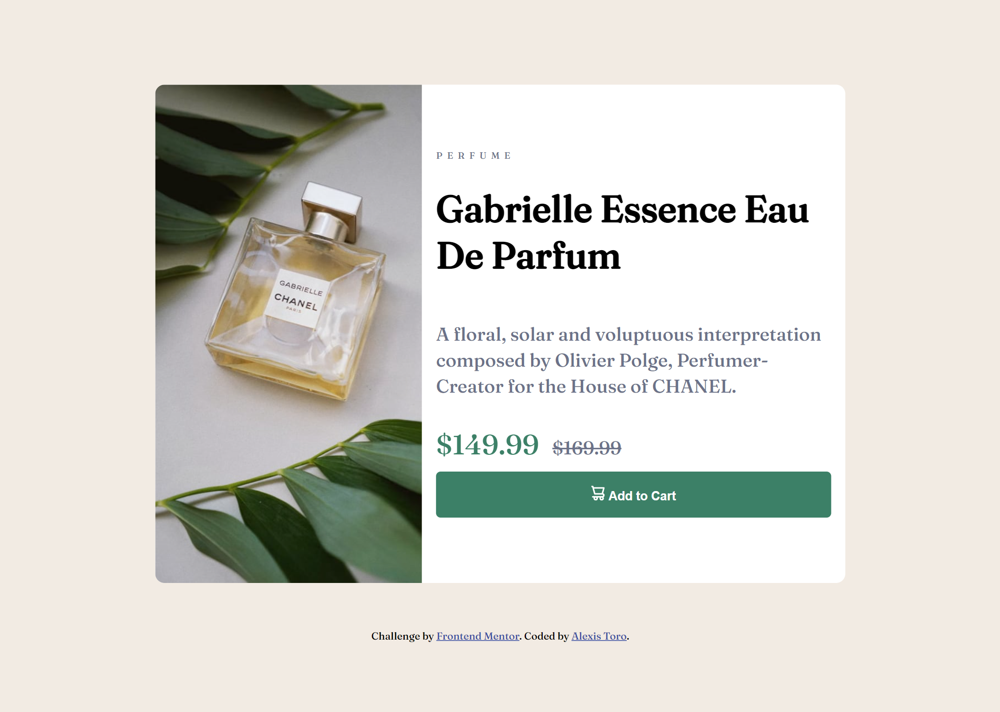

# Frontend Mentor - Product preview card component solution

This is a solution to the [Product preview card component challenge on Frontend Mentor](https://www.frontendmentor.io/challenges/product-preview-card-component-GO7UmttRfa). Frontend Mentor challenges help you improve your coding skills by building realistic projects.

## Table of contents

- [Overview](#overview)
  - [The challenge](#the-challenge)
  - [Screenshot](#screenshot)
  - [Links](#links)
- [My process](#my-process)
  - [Built with](#built-with)
  - [Continued development](#continued-development)
- [Author](#author)

## Overview

Just a simple solution nothing too fancy

### The challenge

Users should be able to:

- View the optimal layout depending on their device's screen size
- See hover and focus states for interactive elements

### Screenshot

### Links

- Solution URL: [UWU](https://github.com/XxtbmfxX/frontmentor_newbies)
- Live Site URL: [Add live site URL here](https://your-live-site-url.com)

## My process

Retaking web development after learning a bit of ML and AI
I need to get more comfortable whit css and html tags
i think i´ll do a cupple more and then i´ll do a page whit react and an API

### Built with

- Semantic HTML5 markup
- Flexbox
- Mobile-first workflow

### Continued development

Practice more css and try some no-code frameworks

## Author

- Frontend Mentor - [@XxtbmfxX](https://www.frontendmentor.io/profile/XxtbmfxX)
